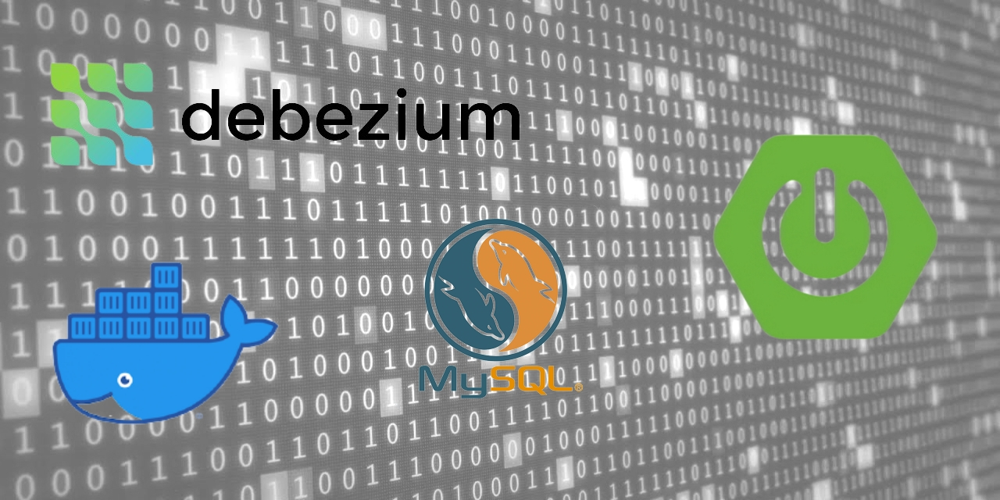

# Spring Boot + Debezium


## PREREQUISITES
- Java
- Docker

<br>

## HOW TO TEST
1. Boot up a MySQL instance with Docker:
```shell
$ docker run --name mysql -e MYSQL_ROOT_PASSWORD=root -e MYSQL_USER=user -e MYSQL_PASSWORD=password -e MYSQL_DATABASE=customerdb -p 3306:3306 --rm -it mysql --binlog-format=ROW --binlog-row-image=FULL --binlog-rows-query-log-events=ON --performance-schema=ON
```

2. Connect to MySQL docker instance:
```shell
$ docker exec -it mysql bash
```

3. Once inside, login into MySQL server:
```shell
# mysql --user=user --password=password
```

4. Once logged in, create the database and table to run the demo application:
```shell
mysql> CREATE DATABASE customerdb;
Query OK, 1 row affected (0.01 sec)
```
```shell
mysql> USE customerdb;
Database changed
```
```shell
mysql> CREATE TABLE customer ( id bigint NOT NULL AUTO_INCREMENT, email varchar(255) DEFAULT NULL, fullname varchar(255) DEFAULT NULL, PRIMARY KEY (id) );
Query OK, 0 rows affected (0.02 sec)
```

1. Logout from the MySQL server and disconnect from the instance
```shell
mysql> exit
Bye
# exit
exit
```

2. Run the application
```shell
$ ./mvnw spring-boot:run
```